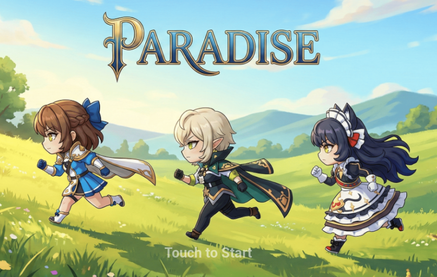

# 🌴 Project Paradise

<p align="center">
  
</p>

<p align="center">
  
  
  
  
</p>

<p align="center">
  <a href="https://paradiseproject.github.io/ParadiseProject_Docs/">
    📄 API 문서 (Doxygen + GitHub Pages) 보러가기
  </a>
</p>

---

## 📌 프로젝트 소개

> 스쿼드 액션과 디펜스가 결합된 모바일 기반 전략 게임

| 항목 | 내용 |
|:---|:---|
| 🎮 장르 | 태그 액션 타워 디펜스 (스쿼드 타워 디펜스 RPG) |
| 🖥️ 대상 플랫폼 | Windows (PC) / Android (Mobile) |
| 👥 개발 인원 | 프로그래머 5명 (유성민, 김성현, 김수진, 김민준, 최지원) |
| 📅 개발 기간 | 2026.02.03 ~ 2026.04.03 |
| ⚙️ 개발 환경 | Unreal Engine 5.5.4, C++, GitHub Desktop, Notion |
| 🔌 주요 플러그인 | GameplayAbilities, CommonUI, UMG, AIModule |

---

## 🎬 시연 영상

<p align="center">
  <a href="https://youtube.com/링크를_입력하세요">
    
  </a>
</p>

---

## ✨ 주요 기능

| 기능 | 설명 | 코드 바로가기 |
|:---|:---|:---:|
| 태그 시스템 | 전투 중 최대 3인 캐릭터를 키/버튼 입력으로 실시간 교체 | [바로가기](./Source/Paradise/) |
| 타워 디펜스 | 코스트 기반 퍼밀리어 소환  | [바로가기](./Source/Paradise/) |
| 무기 스킬 & 궁극기 | GAS(GameplayAbilitySystem) 기반 캐릭터 고유 콤보 및 필살기 | [바로가기](./Source/Paradise/) |
| 크로스 플랫폼 입력 | PC 키보드 / 모바일 가상 조이스틱 동시 지원 (CommonUI) | [바로가기](./Source/Paradise/) |
| AI 퍼밀리어 | AIModule 기반 소환 유닛 자율 행동 | [바로가기](./Source/Paradise/) |

---

## 🎮 조작 방법 (Controls)

본 프로젝트는 Windows(PC) 및 Android(Mobile) 크로스 플랫폼 조작을 지원합니다.

| 기능 | Windows (Key) | Android (UI) | 동작 정의 |
| :--- | :---: | :---: | :--- |
| **캐릭터 이동** | <kbd>W</kbd> <kbd>A</kbd> <kbd>S</kbd> <kbd>D</kbd> | 가상 조이스틱 (좌측 하단) | 현재 캐릭터로 이동 |
| **캐릭터 태그** | <kbd>U</kbd> <kbd>I</kbd> <kbd>O</kbd> | 캐릭터 아이콘 (우측 상단) | 해당 번호 캐릭터로 즉시 교체 |
| **기본 공격** | <kbd>J</kbd> | 공격 버튼 (우측 하단) | 장착된 무기로 고유 공격 |
| **무기 스킬** | <kbd>K</kbd> | 스킬 아이콘 (공격 버튼 좌측) | 장착된 무기로 스킬 공격 |
| **궁극기 (필살기)** | <kbd>L</kbd> | 궁극기 아이콘 (공격 버튼 상단) | 캐릭터의 고유한 궁극기 사용 |
| **퍼밀리어 소환** | <kbd>1</kbd> <kbd>2</kbd> <kbd>3</kbd> <kbd>4</kbd> <kbd>5</kbd> | 퍼밀리어 슬롯 (중앙 하단) | 슬롯에 등록된 유닛 소환 |

---


## 🗂️ 프로젝트 구조

```
📁 Source/
 └── 📁 Paradise/
      ├── 📁 Private/               # 구현부 (.cpp)
      │    ├── 📁 AI/               # AI 행동 트리, 퍼밀리어 AI
      │    ├── 📁 Actors/           # 게임 액터 (투사체, 오브젝트 등)
      │    ├── 📁 Characters/       # 캐릭터
      │    ├── 📁 Components/       # 컴포넌트
      │    ├── 📁 Data/             # 데이터 에셋, 테이블
      │    ├── 📁 Debug/            # 디버그 유틸리티
      │    ├── 📁 Framework/        # 게임 모드, 매니저, 코어시스템
      │    ├── 📁 GAS/              # GameplayAbilitySystem (스킬, 궁극기)
      │    ├── 📁 Interfaces/       # UInterface 정의
      │    ├── 📁 Objects/          # UObject 기반 데이터/로직
      │    └── 📁 UI/               # HUD, 조이스틱, 슬롯 UI (CommonUI)
      ├── 📁 Public/                # 헤더부 (.h)
      └── 📄 Paradise.Build.cs      # 모듈 빌드 설정
📁 Content/                         # UE 에셋 (블루프린트, 맵, VFX 등)
📁 Config/                          # 프로젝트 설정 (.ini)
📁 DesignData/                      # 기획 데이터 (밸런스 시트 등)
📁 Build/                           # 빌드 결과물
📁 .github/                         # PR 템플릿, 이슈 템플릿
```

---

## 🛠️ 코드 컨벤션

### 에셋 네이밍 규칙 (Unreal 표준)

| 접두사 | 에셋 종류 |
|:---:|:---|
| `BP_` | 블루프린트 |
| `SK_` | 스켈레탈 메시 |
| `SM_` | 스태틱 메시 |
| `T_` | 텍스처 |
| `M_` | 머티리얼 |
| `WBP_` | 위젯 블루프린트 |
| `ABP_` | 애니메이션 블루프린트 |
| `GA_` | GameplayAbility |

### 코드 스타일 (C++)

- 클래스명: UE5 표준 접두사 적용 (`A`, `U`, `F`, `E`, `I`)
- 멤버 변수: CamelCase (예: `CharacterHP`)
- 함수명: PascalCase (예: `GetCurrentCharacter()`)
- 주석: `/** */` Doxygen 형식 → [자동 생성 API 문서](https://paradiseproject.github.io/ParadiseProject_Docs/)

### 아키텍처

- **GAS (GameplayAbilitySystem)** 기반 스킬 / 궁극기 / 버프 시스템
- **CommonUI** 기반 크로스 플랫폼 입력 추상화
- **AIModule** 기반 퍼밀리어 행동 트리

---

## 📝 Git 컨벤션

### Commit Message Prefix

| prefix | 설명 |
|:---:|:---|
| `feat` | 새로운 기능 추가 |
| `fix` | 버그 수정 |
| `docs` | 문서 수정 |
| `refactor` | 코드 리팩토링 |
| `asset` | 에셋 추가 / 수정 |
| `chore` | 빌드, 설정 변경 |

```
feat: 태그 시스템 캐릭터 즉시 교체 로직 추가
fix: 모바일 조이스틱 입력 누락 버그 수정
asset: 퍼밀리어 소환 VFX 추가
docs: API 문서 Controls 섹션 업데이트
```

### Branch 전략

| 브랜치 | 용도 |
|:---:|:---|
| `main` | 배포 / 최종 빌드 |
| `develop` | 개발 통합 브랜치 |
| `feature/기능명` | 기능 개발 |
| `fix/버그명` | 버그 수정 |

### PR 가이드
- PR은 `develop` 브랜치로 요청
- 최소 1인 이상 리뷰 후 머지
- PR 템플릿에 맞게 작성 필수 (`.github/` 참고)

---

## 👥 팀원

| 이름 | 역할 | GitHub |
|:---:|:---:|:---:|
| 김성현 | 코어 시스템 및 프레임워크 |[@SUNMUNG](https://github.com/SUNMUNG) |
| 유성민 | GAS & 데이터 테이블 | [@github-id](https://github.com/) |
| 김수진 | 애니메이션 및 코스트 시스템 | [@github-id](https://github.com/) |
| 김민준 | 퍼밀리어 스포너 및 기지 | [@github-id](https://github.com/) |
| 최지원 | UI & 가챠 시스템 | [@github-id](https://github.com/) |
